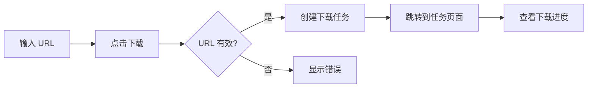
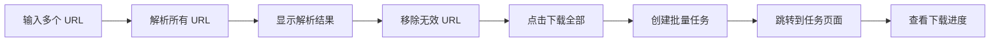

# URL 直接下载功能

## 📋 功能概述

新增的 URL 直接下载功能允许用户通过输入 Pixiv URL 或作品 ID 直接下载作品,无需配置文件。

### 主要特性

- ✅ **单个下载**: 输入单个 URL 或作品 ID 立即下载
- ✅ **批量下载**: 一次性输入多个 URL 进行批量下载
- ✅ **URL 解析**: 支持多种 Pixiv URL 格式自动识别
- ✅ **实时验证**: 下载前验证 URL 有效性
- ✅ **进度跟踪**: 下载任务自动跳转到任务管理页面
- ✅ **国际化**: 完整支持中英文界面

---

## 🎯 支持的 URL 格式

### 插画作品

```
https://www.pixiv.net/artworks/123456
https://www.pixiv.net/en/artworks/123456
https://www.pixiv.net/member_illust.php?mode=medium&illust_id=123456
pixiv.net/artworks/123456
123456 (直接输入作品 ID)
```

### 小说作品

```
https://www.pixiv.net/novel/show.php?id=123456
```

---

## 🚀 使用方法

### 方法 1: 单个下载

1. 点击侧边栏的 "URL 下载" 菜单
2. 在左侧 "单个下载" 卡片中输入 URL 或作品 ID
3. 点击 "解析 URL" 验证(可选)
4. 点击 "立即下载" 开始下载
5. 自动跳转到下载任务页面查看进度

### 方法 2: 批量下载

1. 点击侧边栏的 "URL 下载" 菜单
2. 在右侧 "批量下载" 卡片中输入多个 URL(每行一个)
3. 点击 "解析所有 URL" 验证
4. 查看解析结果,移除无效的 URL(可选)
5. 点击 "下载全部" 开始批量下载
6. 自动跳转到下载任务页面查看进度

---

## 📁 文件结构

### 后端文件

```
/Users/yaoxiaohang/PixivFlow/src/webui/
├── routes/
│   ├── download.ts                              # 更新: 添加 URL 下载路由
│   └── handlers/
│       └── download-url-handlers.ts             # 新增: URL 下载处理器
```

### 前端文件

```
pixivflow-webui/
├── src/
│   ├── pages/
│   │   └── UrlDownload.tsx                      # 新增: URL 下载页面
│   ├── services/
│   │   └── api/
│   │       └── download.ts                      # 更新: 添加 URL 下载 API
│   ├── components/
│   │   └── Layout/
│   │       └── components/
│   │           └── LayoutSider.tsx              # 更新: 添加菜单项
│   ├── locales/
│   │   ├── zh-CN.json                           # 更新: 添加中文翻译
│   │   └── en-US.json                           # 更新: 添加英文翻译
│   └── AppRoutes.tsx                            # 更新: 添加路由
```

---

## 🔧 技术实现

### 后端 API

#### 1. 下载单个 URL

**端点**: `POST /api/download/url`

**请求体**:
```json
{
  "url": "https://www.pixiv.net/artworks/123456"
}
```

**响应**:
```json
{
  "success": true,
  "taskId": "url_task_1234567890",
  "workId": "123456",
  "workType": "illustration",
  "message": "Started downloading illustration 123456"
}
```

#### 2. 批量下载 URL

**端点**: `POST /api/download/batch-url`

**请求体**:
```json
{
  "urls": [
    "https://www.pixiv.net/artworks/123456",
    "https://www.pixiv.net/artworks/789012",
    "123456"
  ]
}
```

**响应**:
```json
{
  "success": true,
  "taskId": "batch_url_task_1234567890",
  "totalUrls": 3,
  "validUrls": 3,
  "invalidUrls": 0,
  "targets": [
    {
      "url": "https://www.pixiv.net/artworks/123456",
      "workId": "123456",
      "workType": "illustration"
    }
  ],
  "message": "Started downloading 3 works"
}
```

#### 3. 解析 URL (不下载)

**端点**: `POST /api/download/parse-url`

**请求体**:
```json
{
  "url": "https://www.pixiv.net/artworks/123456"
}
```

**响应**:
```json
{
  "success": true,
  "workId": "123456",
  "workType": "illustration",
  "originalUrl": "https://www.pixiv.net/artworks/123456"
}
```

### URL 解析逻辑

```typescript
function parsePixivUrl(url: string): { id: string; type: 'illustration' | 'novel' } | null {
  // 1. 纯数字 -> 插画 ID
  if (/^\d+$/.test(url.trim())) {
    return { id: url.trim(), type: 'illustration' };
  }

  // 2. 解析 URL
  const urlObj = new URL(url);
  
  // 3. 检查域名
  if (!urlObj.hostname.includes('pixiv.net')) {
    return null;
  }

  // 4. 提取 ID
  // - /artworks/123456
  // - /member_illust.php?illust_id=123456
  // - /novel/show.php?id=123456
  
  return { id, type };
}
```

### 前端组件

#### UrlDownload 页面组件

**主要功能**:
- 单个 URL 输入和下载
- 批量 URL 输入和下载
- URL 解析和验证
- 解析结果展示
- 使用说明

**状态管理**:
```typescript
const [singleUrl, setSingleUrl] = useState('');
const [batchUrls, setBatchUrls] = useState('');
const [parsedUrls, setParsedUrls] = useState<ParsedUrl[]>([]);
const [loading, setLoading] = useState(false);
const [downloading, setDownloading] = useState(false);
```

---

## 🎨 用户界面

### 页面布局

```
┌─────────────────────────────────────────────────────────────┐
│  URL 直接下载                                                │
│  通过输入 Pixiv URL 或作品 ID 直接下载作品，无需配置文件     │
├─────────────────────────────────────────────────────────────┤
│                                                               │
│  ┌──────────────────────┐  ┌──────────────────────┐        │
│  │  单个下载            │  │  批量下载            │        │
│  │                      │  │                      │        │
│  │  [输入框]            │  │  [文本域]            │        │
│  │  [解析 URL]          │  │  [解析所有 URL]      │        │
│  │  [立即下载]          │  │  [下载全部]          │        │
│  │                      │  │                      │        │
│  │  [解析结果]          │  │  [解析结果统计]      │        │
│  └──────────────────────┘  └──────────────────────┘        │
│                                                               │
│  ┌─────────────────────────────────────────────────────────┐│
│  │  URL 列表 (批量下载时显示)                              ││
│  │  ✓ https://www.pixiv.net/artworks/123456  [移除]       ││
│  │  ✓ https://www.pixiv.net/artworks/789012  [移除]       ││
│  │  ✗ invalid-url (错误信息)                 [移除]       ││
│  └─────────────────────────────────────────────────────────┘│
│                                                               │
│  ┌─────────────────────────────────────────────────────────┐│
│  │  使用说明                                                ││
│  │  • 支持的 URL 格式                                       ││
│  │  • 使用提示                                              ││
│  └─────────────────────────────────────────────────────────┘│
└─────────────────────────────────────────────────────────────┘
```

---

## 🔄 工作流程

### 单个下载流程



### 批量下载流程



---

## 📊 错误处理

### 常见错误

| 错误类型 | 错误信息 | 处理方式 |
|---------|---------|---------|
| 空 URL | "请输入 URL 或作品 ID" | 提示用户输入 |
| 无效 URL | "无效的 Pixiv URL 或 ID" | 显示错误提示 |
| 任务冲突 | "另一个下载任务正在运行" | 等待当前任务完成 |
| 网络错误 | "下载失败" | 显示详细错误信息 |

### 错误响应示例

```json
{
  "errorCode": "INVALID_REQUEST",
  "message": "Invalid Pixiv URL or ID. Supported formats: https://www.pixiv.net/artworks/123456 or just 123456"
}
```

---

## 🌐 国际化

### 中文翻译 (zh-CN.json)

```json
{
  "download": {
    "urlDownload": {
      "title": "URL 直接下载",
      "description": "通过输入 Pixiv URL 或作品 ID 直接下载作品，无需配置文件",
      "singleDownload": "单个下载",
      "batchDownload": "批量下载",
      ...
    }
  }
}
```

### 英文翻译 (en-US.json)

```json
{
  "download": {
    "urlDownload": {
      "title": "URL Direct Download",
      "description": "Download works directly by entering Pixiv URL or work ID, no configuration file needed",
      "singleDownload": "Single Download",
      "batchDownload": "Batch Download",
      ...
    }
  }
}
```

---

## 🧪 测试用例

### 测试 URL 示例

```bash
# 插画 - 标准格式
https://www.pixiv.net/artworks/123456

# 插画 - 带语言前缀
https://www.pixiv.net/en/artworks/123456

# 插画 - 旧格式
https://www.pixiv.net/member_illust.php?mode=medium&illust_id=123456

# 小说
https://www.pixiv.net/novel/show.php?id=123456

# 纯 ID
123456

# 无协议
pixiv.net/artworks/123456
```

### 测试步骤

1. **单个下载测试**
   - 输入有效 URL → 验证解析成功
   - 输入无效 URL → 验证显示错误
   - 输入纯 ID → 验证识别为插画
   - 点击下载 → 验证任务创建成功

2. **批量下载测试**
   - 输入多个有效 URL → 验证全部解析成功
   - 输入混合 URL(有效+无效) → 验证正确区分
   - 移除某个 URL → 验证列表更新
   - 点击下载全部 → 验证批量任务创建

3. **边界测试**
   - 空输入 → 验证提示错误
   - 超长 URL → 验证正常处理
   - 特殊字符 → 验证正确转义
   - 并发下载 → 验证任务冲突检测

---

## 🔐 权限和安全

### 权限要求

- 需要登录才能使用下载功能
- 使用现有的认证机制
- 继承下载任务的权限设置

### 安全考虑

- URL 解析时验证域名
- 防止 SSRF 攻击
- 限制并发下载任务
- 输入验证和清理

---

## 📈 性能优化

### 前端优化

- 懒加载页面组件
- 防抖输入验证
- 批量解析时显示进度
- 虚拟列表(大量 URL 时)

### 后端优化

- URL 解析缓存
- 批量请求合并
- 异步任务处理
- 错误重试机制

---

## 🎯 使用场景

### 场景 1: 快速下载单个作品

用户在浏览 Pixiv 时发现喜欢的作品,直接复制 URL 到 PixivFlow 下载。

### 场景 2: 批量下载收藏作品

用户整理了一份收藏作品的 URL 列表,一次性粘贴到批量下载框进行下载。

### 场景 3: 分享作品列表

用户收到朋友分享的作品 ID 列表,快速下载这些作品。

### 场景 4: 补充下载

用户发现某些作品未下载,通过 URL 快速补充下载,无需修改配置文件。

---

## 🚧 未来改进

### 计划功能

- [ ] 从剪贴板自动识别 URL
- [ ] 支持用户主页 URL(下载该用户所有作品)
- [ ] 支持标签页 URL(下载该标签下的作品)
- [ ] 下载历史记录(避免重复下载)
- [ ] URL 导入/导出功能
- [ ] 自定义下载选项(质量、格式等)

### 性能改进

- [ ] 批量下载进度条
- [ ] 并发下载数量控制
- [ ] 下载队列管理
- [ ] 断点续传支持

---

## 📚 相关文档

- [下载任务管理](./DOWNLOAD_TASKS.md)
- [API 文档](./API_REFERENCE.md)
- [配置指南](./CONFIG_GUIDE.md)

---

## 💡 提示

1. **URL 格式**: 支持多种格式,包括直接输入作品 ID
2. **批量下载**: 每行一个 URL,支持混合格式
3. **任务管理**: 下载任务会自动跳转到任务管理页面
4. **错误处理**: 无效 URL 会被标记,不影响其他 URL 下载

---

## 🎉 总结

URL 直接下载功能为 PixivFlow 提供了更便捷的下载方式:

- ✅ **简单**: 无需配置文件,直接输入 URL
- ✅ **快速**: 立即下载,无需等待
- ✅ **灵活**: 支持单个和批量下载
- ✅ **友好**: 直观的界面和清晰的提示

现在您可以更轻松地下载 Pixiv 作品了! 🚀

